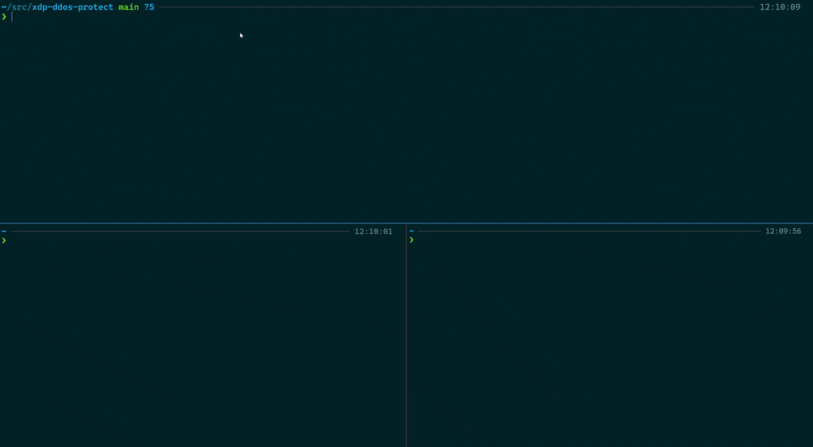
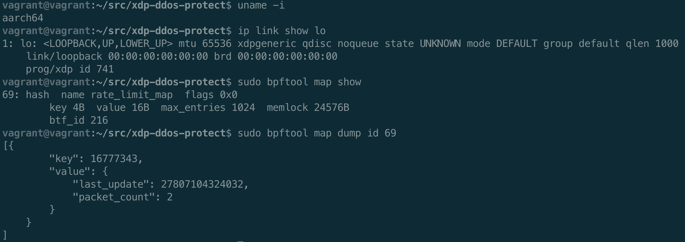

[](https://github.com/SRodi/xdp-ddos-protect/actions/workflows/test.yml)

# Protect from DDoS attacks with XDP 

The [xdp_ddos_protection.c](./xdp_ddos_protection.c) file contains an eBPF program designed for DDoS protection using XDP (eXpress Data Path).

This README.md also contains simple instructions to simulate a `SYN flood attack` on the lo interface by running a local server used as a target, which listens on a given TCP port, and a client which sends many SYN packets to the target.



## Program logic

The `eBPF XDP program` includes the necessary Linux kernel headers and defines constants for rate limiting, such as the maximum packets per second (`THRESHOLD`) and the time window in nanoseconds (`TIME_WINDOW_NS`).The program maintains a hash map (`rate_limit_map`) to track the rate limit for each source IP address, storing the last update timestamp and packet count within the time window.

The ddos_protection function, marked with the `SEC("xdp")` section, processes incoming packets, starting by parsing the `Ethernet header`. It checks if the packet is an `IP packet` and ensures that the packet data is within bounds before proceeding with further processing. If the packet is not an IP packet or the data is out of bounds, it passes the packet without any action.

If none of the above conditions are met, the function then extracts the source IP address from the IP header of the incoming packet. It then looks up a rate limit entry for this IP address in the `rate_limit_map` BPF map.

The current time is fetched in nanoseconds using `bpf_ktime_get_ns()`. If an entry for the source IP exists, the code checks if the current time is within the same time window defined by `TIME_WINDOW_NS`. If it is, the packet count for this IP is incremented. If the packet count exceeds a predefined `THRESHOLD`, the packet is dropped by returning `XDP_DROP`. If the time window has elapsed, the packet count is reset, and the time of the last update is set to the current time.

If no entry exists for the source IP, a new rate limit entry is initialized with the current time and a packet count of one. This new entry is then added to the rate_limit_map. If the packet count is within the threshold, the packet is allowed to pass by returning `XDP_PASS`. This mechanism helps in mitigating DDoS attacks by limiting the rate of packets from any single IP address.

## Compatibility

This program is compatible for both `amd64` and `arm64` architectures. The program was tested on Ubuntu/Debian Linux distributions with `kernel version >= 5.15`.



## Repository files

* [Makefile](./Makefile): help to compile, attach, and detach the BPF program
* [README.md](./README.md): provides instructions and documentation
* [xdp_ddos_protection.c](./xdp_ddos_protection.c): eBPF program for DDoS protection using XDP

## Installation

1. . **Install clang, llvm, libbpf and make**:
    ```sh
    sudo apt-get install clang llvm libbpf-dev make -y
    ```
2. **Clone the repository**:
    ```sh
    git clone https://github.com/srodi/xdp-ddos-protect.git
    cd xdp-ddos-protect
    ```

## Compile BPF code
To compile BPF XDP program, run:
```sh
make compile
```

## Attach the BPF program
To attach the program to `lo` interface, use:
```sh
make attach
```

To attach to another interface:
```sh
make attach IFACE=eth0
```

## Detach program
To detach the BPF program
```sh
make detach
```

## Test

To test a DDoS attack, you can use `hping3` tool, here is a script
```sh
sudo apt install hping3
```

Run an `nginx` server locally using `docker`:
```sh
docker run -p 1234:80 nginx
```
Then run the test:
```sh
sudo hping3 -i u1000 -S -p 1234 127.0.0.1
```

The `-i u1000` option in the `hping3` command specifies the interval between packets. Here, `u1000` means 1000 microseconds (1 millisecond) between each packet. This option is used to control the rate of packet sending, which is useful for simulating high traffic or DDoS attacks.

The `-S` option in the `hping3` command specifies that the SYN flag should be set in the TCP packets. This is used to simulate a SYN flood attack, which is a type of DDoS attack where many SYN packets are sent to a target to overwhelm it.

## Troubleshooting

**Add the correct include path**
If the header files `types.h` are located in a different directory than `/usr/include/asm`, you can add the include path manually via environment variable `C_INCLUDE_PATH`:

```sh
# ensure asm/types.h exists in the expected directory
find /usr/include -name 'types.h'

# example for Ubuntu 24.04 x86_64 
export C_INCLUDE_PATH=/usr/include/x86_64-linux-gnu
```

**Disable LRO**
If you're encountering an issue with attaching an XDP program to the eth0 interface with a similar error to the following, this is due to Large Receive Offload (LRO) being enabled.

```sh
$ sudo ip link set dev eth0 xdp obj xdp_ddos_protection.o sec xdp
Error: hv_netvsc: XDP: not support LRO.
```
The error message indicates that the hv_netvsc driver does not support XDP when LRO is enabled. To resolve this issue, you need to disable LRO on the eth0 interface before attaching the XDP program. You can do this using the ethtool command:

```sh
sudo ethtool -K eth0 lro off
```

## Considerations

The test presented above uses `lo` which is a virtual network interface - by default, XDP is designed to work on physical and virtual interfaces that send and receive packets from the network. The loopback interface behaves differently because it is a purely software interface used for local traffic within the system.

Traffic on the loopback interface is not "real" network traffic, it is handled entirely within the kernel. As a result, certain packet processing steps (like those involving hardware offload) are bypassed, and this can affect how XDP interacts with the loopback interface.

The performance benefits of XDP may be less pronounced for loopback traffic compared to physical interfaces. This means the performance is greater on regular network interfaces like `eth0`, which represent a physical hardware device. 

## License
This project is licensed under the MIT License. See the LICENSE file for details.